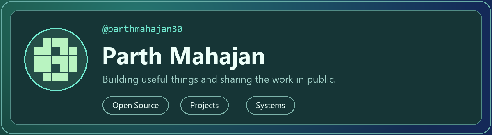
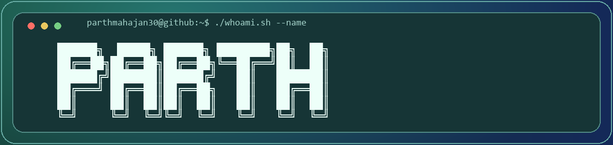
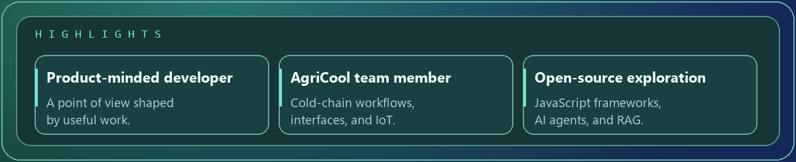
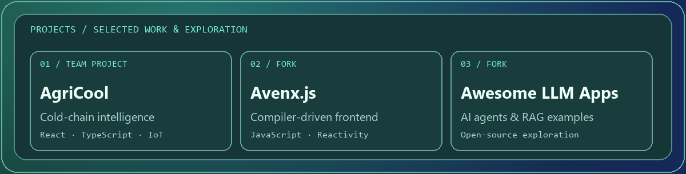
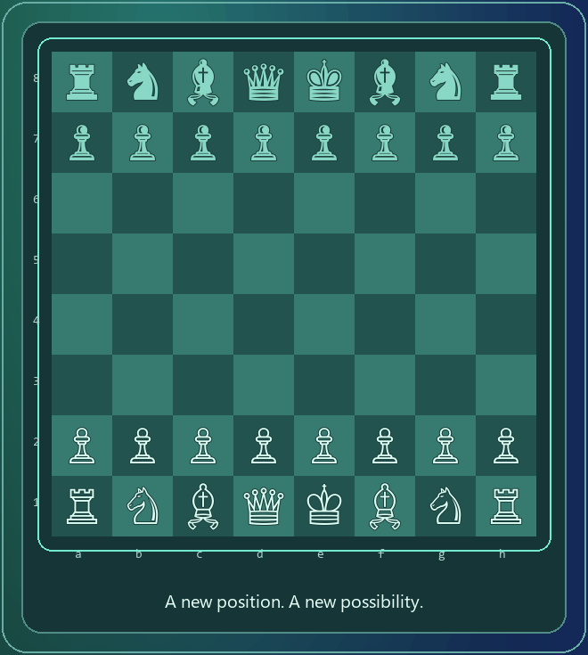

AN EDITORIAL PROFILE · PARTHMAHAJAN30

  

[Open Source](https://github.com/parthmahajan30) · [Projects](https://github.com/parthmahajan30?tab=repositories) · [Systems](#production-palette)

### Product-minded developer · the public internet

Building useful things and sharing the work in public.

[GitHub](https://github.com/parthmahajan30)

**─────── ◦ ───────**

## The point of view

<table>
<tr>
<td width="58%" valign="top">

### Building useful things and sharing the work in public.

Small teams, ambitious ideas, and useful collaborations.

Part of the **AgriCool team**, exploring cold-chain intelligence through web interfaces and IoT workflows.

</td>
<td width="42%" valign="top">

**PROFILE**

**ROLE** · Product-minded developer 
**FOCUS** · Web interfaces, IoT, open source 
**CURRENT REEL** · AgriCool

[Repositories →](https://github.com/parthmahajan30?tab=repositories) 
[Contribution history →](https://github.com/parthmahajan30?tab=overview)

</td>
</tr>
</table>

─────── ◦ ───────

## In the current cut

The ideas, experiments, and decisions moving the work forward.

─────── ◦ ───────

## Production palette

Tools used across the projects I work on and explore.

Open source · tools chosen for the work, not the trend.

─────── ◦ ───────

## Featured reel

<table>
<tr>
<td width="34%" valign="top">

### [AgriCool](https://github.com/parthmahajan30/skh2)

**Team project · hackathon prototype**

Cold-chain intelligence connecting farmer, storage, logistics, and governance workflows. React/TypeScript interfaces with ESP32/Wokwi demonstrations.

Team: Abhijay Junnare, Parth Mahajan, Janhavi Borade, Aditya Inamke.

[Original team repository →](https://github.com/aaditya755/skh2)

</td>
<td width="33%" valign="top">

### [Avenx.js](https://github.com/parthmahajan30/avenx-js)

**Open-source fork · JavaScript**

A compiler-driven frontend framework with proxy-based reactivity. Part of my exploration of frontend systems.

[Upstream project →](https://github.com/Avenx-JS/avenx-js)

</td>
<td width="33%" valign="top">

### [Awesome LLM Apps](https://github.com/parthmahajan30/awesome-llm-apps)

**Open-source fork · AI exploration**

A collection of AI agents, agent skills, and RAG application examples to explore and learn from.

[Upstream collection →](https://github.com/Shubhamsaboo/awesome-llm-apps)

</td>
</tr>
</table>

─────── ◦ ───────

## Contribution trail

**SNAKE TRAIL · ONE CONTINUOUS RUN**

<!-- Run the included contribution-snake workflow after uploading the files. -->

[View contribution history →](https://github.com/parthmahajan30?tab=overview)

Generated from my GitHub activity · refreshed daily

─────── ◦ ───────

## Play the next move

An opening replay · every commit is another move.

**─────── ◦ ───────**

 

THE NEXT SCENE

### Keep the story moving

I enjoy working with people who care about the details, share the context, and ship something useful.

[Connect on GitHub →](https://github.com/parthmahajan30)

 

Parth Mahajan · Dark terminal · Teal glow · Built in public

